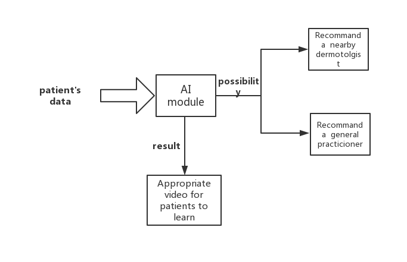

# Skin Cancer Detection App
This is the group project for EC500 and this application is used for detect the skin disease and provide the best advices for the patients. serves for the Skin Cancer patients and potential patient.

## User Story
This apllication serves for the some Skin Cancer patients and potential patients.
- For the Skin Cancer patients, this app can detect the skin situation and give appropriate recommendations. For example, if the situation is not really serious, the app will suggestion the patients just find a general practicioner. if it is high priority, recommend nearby dermotolgist.

- For the poential Skin patients, this app can detect their skin and give a feedback. Also it will provide a video base on the skin result to educate the user.

 Sprint 1
 =========
- Set up the environment of Android App.
- Find an Implemented AI model.
- Find dataset to train the AI model.
- Find the API to provide the doctor information.

 Technologies to be used
 -------
- Tensorflow: Use For Machine Learning 
- Kaggle: Find the dataset to use
- Kivy：open source Python library for developing mobile apps

 Project diagram
 ------
_

 API
 -------
 Google Map API: provide the nearby doctor information

 Task Assignment:
 ------
- Wanxuan Chen: Google map API, environment of App
- Yucheng Zhu: Implemented AI moddule and dataset

 Sprint 2
 ==============
 - Get the AI model trained and can classify single picture         (training on the SCC)
 - Set up the frame of Android App                                 (completed)
 
