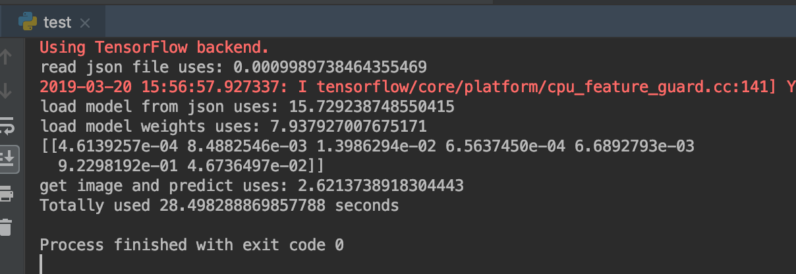
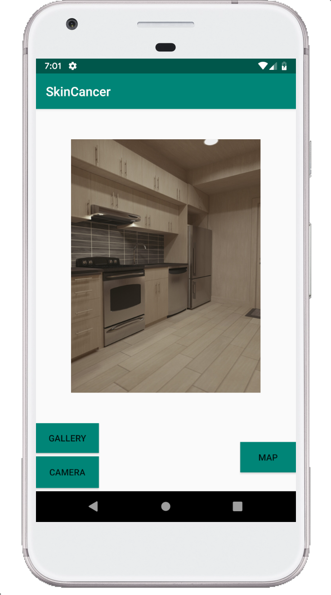
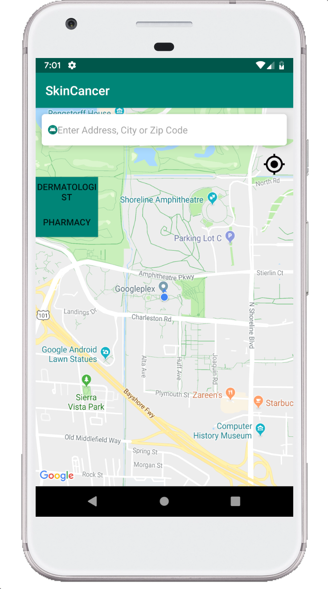

# Skin Cancer Detection App
This is the group project for EC500 and this application is used for detect the skin disease and provide the best advices for the patients. serves for the Skin Cancer patients and potential patient.

## User Story
This apllication serves for the some Skin Cancer patients and potential patients.
- For the Skin Cancer patients, this app can detect the skin situation and give appropriate recommendations. For example, if the situation is not really serious, the app will suggestion the patients just find a general practicioner. if it is high priority, recommend nearby dermotolgist.

- For the poential Skin patients, this app can detect their skin and give a feedback. Also it will provide a video base on the skin result to educate the user.

 Sprint 1
 =========
- Set up the environment of Android App.
- Find an Implemented AI model.
- Find dataset to train the AI model.
- Find the API to provide the doctor information.

 Technologies to be used
 -------
- Tensorflow: Use For Machine Learning 
- Kaggle: Find the dataset to use
- Kivy：open source Python library for developing mobile apps

 Project diagram
 ------

 API
 -------
 Google Map API: provide the nearby doctor information

 Task Assignment:diagram.jpg
 ------
- Wanxuan Chen: Google map API, environment of App
- Yucheng Zhu: Implemented AI moddule and dataset

 Sprint 2
 ==============
  Get the AI model trained and can classify single picture  
  -----
 (completed)  
 However, found a drawback that it takes a little long to load the pretrained model, for now it takes about 29 seconds. 
 Try to fater the load model process, which takes 58s at first.  
 - First try to add K.clear_session() to "Destroys the current TF graph and creates a new one.Useful to avoid clutter from old models / layers." https://www.tensorflow.org/api_docs/python/tf/keras/backend/clear_session.  
 But it doensn't work.   
 - Then I tried to set some compile parameters when I use "model = load_model(model.h5)" loading my model, and it got slower about 5 seconds. Finally I set the load_model function with "compile = false", and the time reduce to 28 s.  
 - Finally, I tried to create model's weight in hdf5 type and convert model to json file, so that when I predict, I only need load the weight file and json file without loading the large model directly. And it takes 29s. I think it's the best way for now though.    
 
 

 Set up the frame of Android App  
 ----------
 (completed)
 The app bulid on the Android Studio. Currently, the basic framework of app is complete. 
 
 - The App can take pictures from camera and local gallery as test material. 
 
 
 
 - Moreover, the app connect to google map Api and can show the nearby doctor and phramacy.
 
  
 
 Sprint 3
 ==============
 Tried different implementation of models.
 
 To get the best performance, we tried three kinds of model: 1.keras(resnet inception v2) 2.Tensorflow lite 3.mobile net 4.tensorflow
 
 After we choose keras model, we found the model's size is too big to implement into mobile, like we mentioned in sprint2. To figure out why it was so big, we first try to train with small dataset, but the model's size didn't change much. Then we decrease the number of labels from 7 to 2, the result is same. Finally, by searching resource we found out it's because of the resnet inception v2's structure is so big, about 152 layers. 
 
 And then we choose the Tensorflow lite to make the model smaller. After transform, the size decrease to 200MB compared with 650MB. However, when we want to implement the model into app, we found we don't have too much tutorial to follow since TF-lite just came out last year.
 
Then we tried the mobile net as our model. This model has good fearure on size by using Depthwise Conv decreasing the number of parameters and calculations. However the model we found for skin cancer doesn't give a right result when we  do the prediction and return one label all the time, so we pass this choice either.

Finally we chose tensorflow model, the .pb file. It's much easier than tflite to implement on android, and it's much smaller than Resnet (83.4MB compared with 650MB). And it's incredible fast to predict images on phone, bravoo!

 Sprint 4
 ==============
 
